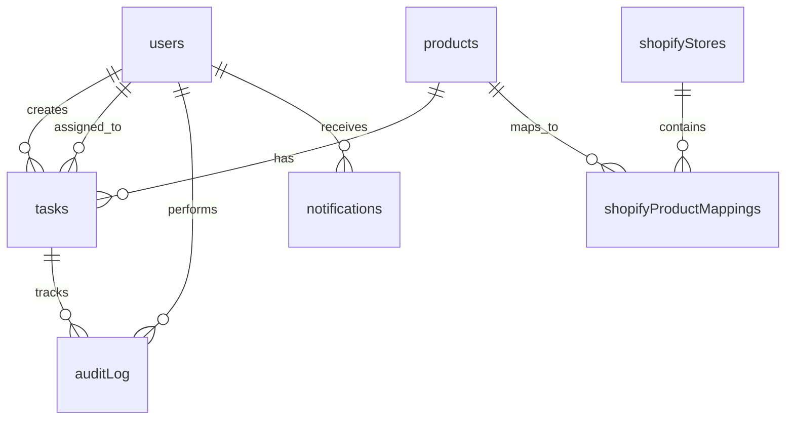

# ShopSyncFlow Todo Project

> A comprehensive product workflow management system for Shopify store operations with role-based task management, SLA monitoring, and automated publishing workflows.

[](https://www.typescriptlang.org/)
[](https://reactjs.org/)
[](https://nodejs.org/)
[](https://www.postgresql.org/)
[](https://shopify.dev/)

## 🎯 Project Overview

ShopSyncFlow is a sophisticated workflow management application designed to streamline product operations for Shopify stores. It provides role-based task management, real-time collaboration, SLA monitoring, and automated publishing workflows to ensure efficient product lifecycle management from creation to publication.

### 🔑 Key Features

- **🏗️ Multi-Role Workflow Management** - SuperAdmin, WarehouseManager, Editor, and Auditor roles
- **📊 Kanban Board Interface** - Visual task tracking with drag-and-drop functionality
- **⏱️ SLA Monitoring** - Real-time countdown timers and breach alerts
- **🛍️ Shopify Integration** - Automated product publishing and inventory sync
- **✅ Quality Assurance** - Dynamic checklists and approval workflows
- **📈 Analytics Dashboard** - Performance metrics and workflow insights
- **🔄 Real-time Collaboration** - Live updates, comments, and notifications

## 📋 Current Status

**Implementation Progress**: ~15-20% Complete

### ✅ Completed Components
- **Database Schema**: Complete with all tables and relationships
- **Tech Stack Setup**: React 18, Express.js, PostgreSQL, Drizzle ORM
- **Authentication Base**: Session-based auth with Passport.js
- **Project Structure**: Organized codebase with proper TypeScript configuration

### 🚧 In Development
- Core API endpoints
- User interface components
- Workflow state machine
- Shopify API integration

### 📊 Progress Tracking
- **Latest Gap Analysis**: [September 17, 2025](./documentation/gap-analysis/Gap_Analysis_Report_2025-09-17.md)
- **Implementation Plan**: [18-Week Roadmap](./documentation/Implementation_Plan_Checklist.md)
- **Next Review**: October 17, 2025

## 🚀 Quick Start

### Prerequisites

- **Node.js** 18.x or higher
- **PostgreSQL** 14.x or higher
- **pnpm** (recommended) or npm

### Installation

1. **Clone the repository**
   ```bash
   git clone https://github.com/Willabor/ShopSyncFlow-Todo-Project.git
   cd ShopSyncFlow-Todo-Project
   ```

2. **Install dependencies**
   ```bash
   npm install
   ```

3. **Environment Setup**
   ```bash
   cp .env.example .env
   # Configure your database connection and other environment variables
   ```

4. **Database Setup**
   ```bash
   npm run db:push
   ```

5. **Start Development Server**
   ```bash
   npm run dev
   ```

6. **Open Application**
   ```
   http://localhost:5000
   ```

## 🏗️ Architecture

### Tech Stack

| Layer | Technology | Purpose |
|-------|------------|---------|
| **Frontend** | React 18 + TypeScript | User interface and interactions |
| **Routing** | Wouter | Lightweight client-side routing |
| **Styling** | Tailwind CSS + Radix UI | Responsive design and components |
| **Backend** | Express.js + TypeScript | API server and business logic |
| **Database** | PostgreSQL + Drizzle ORM | Data persistence and queries |
| **Authentication** | Passport.js + Sessions | User authentication and security |
| **Integration** | Shopify Admin API | E-commerce platform connectivity |

### Database Schema



### Core Entities

- **Users**: Role-based system (SuperAdmin, WarehouseManager, Editor, Auditor)
- **Products**: Core product information and metadata
- **Tasks**: Workflow items with state management
- **Audit Log**: Complete activity tracking
- **Shopify Integration**: Multi-store management and synchronization

## 🔧 Available Scripts

| Script | Description |
|--------|-------------|
| `npm run dev` | Start development server with hot reload |
| `npm run build` | Build production application |
| `npm run start` | Start production server |
| `npm run check` | Run TypeScript type checking |
| `npm run db:push` | Push database schema changes |

## 🎭 User Roles & Permissions

### 👑 Super Admin
- **Dashboard**: Complete system overview and management
- **Permissions**: Full access to all features and user management
- **Responsibilities**: System configuration, user management, final approvals

### 📦 Warehouse Manager
- **Dashboard**: Inventory-focused task management
- **Permissions**: Inventory updates, warehouse task completion
- **Responsibilities**: Stock management, product dimensions, shipping data

### ✏️ Editor
- **Dashboard**: Content creation and editing workflow
- **Permissions**: Product content creation, editing, draft management
- **Responsibilities**: Product descriptions, images, content quality

### 🔍 Auditor
- **Dashboard**: Quality assurance and compliance monitoring
- **Permissions**: Read-only access, quality checklist validation
- **Responsibilities**: Content review, compliance verification, quality control

## 🔄 Workflow States

The system implements an 8-stage workflow for product management:

```
NEW → TRIAGE → ASSIGNED → IN_PROGRESS → READY_FOR_REVIEW → PUBLISHED → QA_APPROVED → DONE
```

Each state has specific SLA requirements and role-based permissions for transitions.

## 🛍️ Shopify Integration

### Features
- **Multi-Store Management**: Connect and manage multiple Shopify stores
- **Product Publishing**: Automated product creation and updates
- **Inventory Synchronization**: Real-time stock level management
- **Webhook Support**: Bi-directional data synchronization

### Supported Operations
- Product creation and updates
- Inventory level synchronization
- Order status tracking
- Store health monitoring

## 📁 Project Structure

```
ShopSyncFlow-Todo-Project/
├── client/                    # React frontend application
│   ├── src/
│   │   ├── components/       # Reusable UI components
│   │   ├── pages/           # Page components
│   │   ├── hooks/           # Custom React hooks
│   │   └── lib/             # Utility functions
├── server/                   # Express backend application
│   ├── auth.ts              # Authentication logic
│   ├── index.ts             # Server entry point
│   └── routes.ts            # API route definitions
├── shared/                   # Shared code between client/server
│   └── schema.ts            # Database schema and types
├── documentation/           # Project documentation
│   ├── gap-analysis/        # Progress tracking reports
│   └── Implementation_Plan_Checklist.md
└── README.md               # This file
```

## 📖 Documentation

### 📚 Available Documentation
- **[Implementation Plan](./documentation/Implementation_Plan_Checklist.md)** - Comprehensive 18-week development roadmap
- **[Gap Analysis](./documentation/gap-analysis/)** - Progress tracking and assessment reports
- **[Technical Documentation](./documentation/)** - Architecture and implementation details

### 🔍 API Documentation
*Coming Soon* - API documentation will be available once core endpoints are implemented.

## 🧪 Testing

*Testing framework setup is planned for Phase 1 of implementation.*

Target testing approach:
- **Unit Tests**: Business logic and utility functions
- **Integration Tests**: API endpoints and database operations
- **Component Tests**: React component functionality
- **E2E Tests**: Complete user workflows

## 🚀 Deployment

*Deployment configurations will be added during Phase 6 of implementation.*

Planned deployment targets:
- **Development**: Local development environment
- **Staging**: Pre-production testing environment
- **Production**: Live application deployment

## 🤝 Contributing

### Development Workflow

1. **Fork the repository**
2. **Create a feature branch**
   ```bash
   git checkout -b feature/your-feature-name
   ```
3. **Make your changes**
4. **Run tests** (when available)
5. **Commit your changes**
   ```bash
   git commit -m "Add your feature description"
   ```
6. **Push to your branch**
   ```bash
   git push origin feature/your-feature-name
   ```
7. **Create a Pull Request**

### Code Standards

- **TypeScript**: Strict mode enabled, no `any` types
- **ESLint + Prettier**: Code formatting and linting
- **Conventional Commits**: Structured commit messages
- **Code Coverage**: Target >80% test coverage

## 🗺️ Roadmap

### Phase 1: Foundation & Backend Core (Weeks 1-3)
- ✅ Authentication system enhancement
- ✅ Core API development
- ✅ Data validation and business logic

### Phase 2: Core UI & User Experience (Weeks 4-6)
- 🔲 Role-based dashboards
- 🔲 Task management interface
- 🔲 Basic workflow operations

### Phase 3: Workflow Engine & Business Logic (Weeks 7-9)
- 🔲 State machine implementation
- 🔲 SLA monitoring system
- 🔲 Quality control workflows

### Phase 4: Advanced UI Features (Weeks 10-12)
- 🔲 Kanban board implementation
- 🔲 Analytics dashboards
- 🔲 Real-time collaboration features

### Phase 5: Shopify Integration (Weeks 13-15)
- 🔲 Shopify API client
- 🔲 Product publishing automation
- 🔲 Webhook handling and synchronization

### Phase 6: Polish & Production Readiness (Weeks 16-18)
- 🔲 Performance optimization
- 🔲 Testing and quality assurance
- 🔲 Production deployment setup

*For detailed task breakdown, see [Implementation Plan](./documentation/Implementation_Plan_Checklist.md)*

## 📈 Project Metrics

### Current Status (September 17, 2025)
- **Database Schema**: 100% Complete
- **Authentication**: 70% Complete (Session-based)
- **API Layer**: 10% Complete
- **UI Components**: 5% Complete
- **Shopify Integration**: 0% Complete
- **Testing**: 0% Complete

### Success Criteria
- **Functionality**: 100% of documented features implemented
- **Performance**: <2s page load times, 99.9% uptime
- **User Adoption**: >90% user satisfaction score
- **Code Quality**: >80% test coverage, zero critical vulnerabilities

## 🐛 Issues & Support

### Reporting Issues
1. **Check existing issues** in the [GitHub Issues](https://github.com/Willabor/ShopSyncFlow-Todo-Project/issues)
2. **Create a new issue** with detailed description and reproduction steps
3. **Use appropriate labels** (bug, feature request, enhancement)

### Getting Help
- **Documentation**: Check the [documentation folder](./documentation/)
- **GitHub Discussions**: Community support and questions
- **Email**: Contact project maintainers

## 📄 License

This project is licensed under the MIT License - see the [LICENSE](LICENSE) file for details.

## 🙏 Acknowledgments

- **Shopify** for the comprehensive Admin API
- **React Team** for the excellent frontend framework
- **Drizzle Team** for the modern ORM solution
- **Tailwind CSS** for the utility-first CSS framework
- **Open Source Community** for the amazing ecosystem

---

## 📊 Quick Links

| Resource | Link |
|----------|------|
| **Live Demo** | *Coming Soon* |
| **Documentation** | [./documentation/](./documentation/) |
| **Gap Analysis** | [Current Report](./documentation/gap-analysis/Gap_Analysis_Report_2025-09-17.md) |
| **Implementation Plan** | [18-Week Roadmap](./documentation/Implementation_Plan_Checklist.md) |
| **Issues** | [GitHub Issues](https://github.com/Willabor/ShopSyncFlow-Todo-Project/issues) |
| **Shopify API Docs** | [Shopify Admin API](https://shopify.dev/docs/admin-api) |

---

**Last Updated**: September 17, 2025
**Current Version**: 0.2.0 (Alpha)
**Maintainer**: [@Willabor](https://github.com/Willabor)